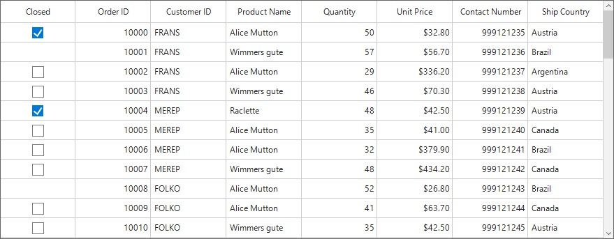

# How to hide checkboxes in a GridCheckBoxColumn of a row based on value of another column in WinForms DataGrid (SfDataGrid) ?

This sample illustrates how to hide checkboxes in a GridCheckBoxColumn of a row based on value of another column.

In SfDataGrid GridCheckBoxColumn, checkbox will be displayed for all the cells by default. You can hide the checkbox for some specific cells in the GridCheckBoxColumn based on another column value in the same row by creating custom renderer for the checkbox column.

```C#
public Form1()
{
    InitializeComponent();
    this.sfDataGrid1.DataSource = new OrderInfoCollection().OrdersListDetails;
    this.sfDataGrid1.CellRenderers["CheckBox"] = new CustomCheckBoxCellRenderer();
}

public class CustomCheckBoxCellRenderer : GridCheckBoxCellRenderer
{
    protected override void OnRender(Graphics paint, Rectangle cellRect, string cellValue, CellStyleInfo style, DataColumnBase column, RowColumnIndex rowColumnIndex)
    {
        if (column.GridColumn.MappingName == "IsClosed")
        {
            DataRowBase dataRow = (DataRowBase)column.GetType().GetProperty("DataRow", System.Reflection.BindingFlags.Instance | 
                System.Reflection.BindingFlags.NonPublic).GetValue(column);

            if ((dataRow.RowData as OrderInfo).Quantity > 50)
                paint.FillRectangle(new SolidBrush(style.BackColor), cellRect);
            else
                base.OnRender(paint, cellRect, cellValue, style, column, rowColumnIndex);
        }
    }
}
```



## Requirements to run the demo
Visual Studio 2015 and above versions
